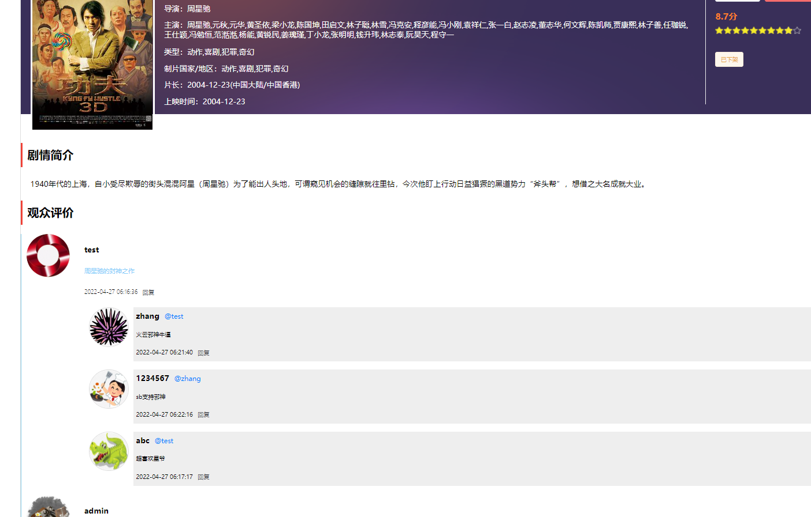

# 猫猫电影

## 项目简介

猫猫电影是一个仿猫眼电影的项目：基于SpringBoot2.x+ MyBatisPlus + MySQL + Shiro+ Vue + 阿里云OSS实现的电影资源分享与购票系统。

**内置账号**

| 账号     | 用户名 | 密码   | 权限     |
| -------- | ------ | ------ | -------- |
| 管理员   | root   | 123456 | 所有权限 |
| 普通用户 | zhang  | 123456 |          |

## 主要功能

- [x] 用户注册（邮箱验证）
- [x] 用户登录
- [x] 权限控制
- [x] 电影榜单
- [x] 电影详情
  - [x] 评论回复
  - [ ] 五星评价
- [ ] 购票
  - [ ] 在线选座
  - [ ] 加入购物车
  - [ ] 支付

### 电影详情页评价回复



## 项目技术栈

**服务端：**

- Spring Boot 2.4.3
- MyBatis Plus
- MySQL 8.0
- shiro（权限安全控制）

- ehcache（本地缓存）
- 阿里云OSS
- easy-captcha（验证码）
- fastdfs（分布式文件系统）
- fastjson（序列化和反序列化）
- hutool工具
  - 随机数
  - 邮件（需要结合 spring-boot-starter-mail）

**前端：**

- vue全家桶
  - vue2.x
  - axios
  - vue-router
  - vuex
- element-ui
- echarts
- hover.css
- less
- qs
- vue-particles

## 项目结构

springboot-server 服务端项目结构：

```shell
├─myFiles
├─src
│  ├─main
│  │  ├─java
│  │  │  └─com
│  │  │      └─xjt
│  │  │          └─movie
│  │  │              ├─config
│  │  │              │  ├─interceptor
│  │  │              │  ├─mybaits
│  │  │              │  └─shiro
│  │  │              ├─controller
│  │  │              ├─entity
│  │  │              ├─mapper
│  │  │              ├─service
│  │  │              │  └─impl
│  │  │              └─utils
│  │  └─resources
│  │      ├─config
│  │      ├─mapper
│  │      ├─static
│  │      └─templates
│  └─test
│      └─java
│          └─com
│              └─xjt
│                  └─movie
```

Vue前端项目结构：

```shell
├─public
└─src
    ├─assets
    │  ├─css
    │  └─images
    │      ├─common
    │      └─components
    ├─components
    │  ├─my-rate
    │  └─nav-bar
    ├─mixins
    ├─network
    ├─router
    ├─store
    ├─utils
    └─views
        ├─board
        │  └─comps
        ├─cinema
        │  └─comps
        ├─film
        │  └─comps
        ├─index
        │  └─comps
        └─news
            └─comps
```


## 写在最后

欢迎关注我的B站账号：https://space.bilibili.com/241154045

 由于技术有限，难免会有一些设计不合理之处，有好的想法，欢迎在b站私信交流！ 

 **开源不易，** 白嫖的小伙伴麻烦顺手点个star吧！